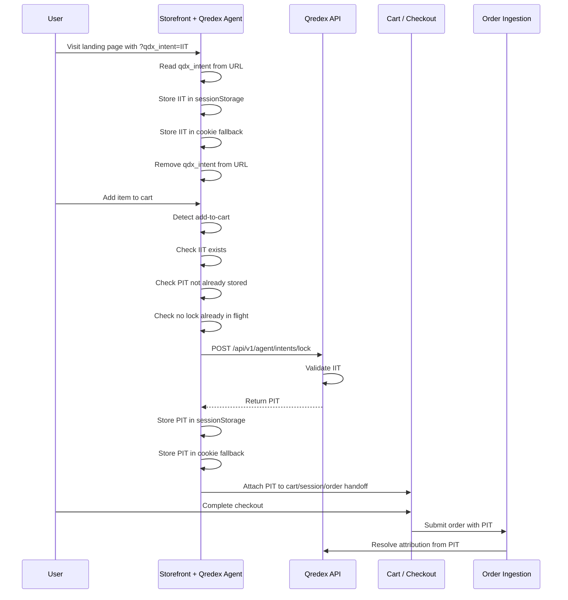

# Qredex Agent - Lock Flow

How the Qredex Agent captures IIT and locks it to PIT.

---

## Overview

The lock flow converts an **Influence Intent Token (IIT)** into a **Purchase Intent Token (PIT)** when a shopper adds a product to their cart.

---

## The Complete Flow

```
┌──────────────────────────────────────────────────────────────────┐
│ 1. Shopper clicks Qredex tracking link                          │
│    → Lands on merchant site with ?qdx_intent=<IIT>              │
└──────────────────────────────────────────────────────────────────┘
                              ↓
┌──────────────────────────────────────────────────────────────────┐
│ 2. Agent auto-starts                                            │
│    → Captures qdx_intent from URL                               │
│    → Stores IIT in sessionStorage + cookie                      │
│    → Cleans URL (removes qdx_intent parameter)                  │
└──────────────────────────────────────────────────────────────────┘
                              ↓
┌──────────────────────────────────────────────────────────────────┐
│ 3. Shopper browses store                                        │
│    → IIT persists in storage                                    │
│    → Agent listens for add-to-cart events                       │
└──────────────────────────────────────────────────────────────────┘
                              ↓
┌──────────────────────────────────────────────────────────────────┐
│ 4. Shopper adds to cart                                         │
│    → Agent detects add-to-cart event                            │
│    → Validates: IIT exists, PIT doesn't, no lock in flight      │
└──────────────────────────────────────────────────────────────────┘
                              ↓
┌──────────────────────────────────────────────────────────────────┐
│ 5. Agent calls lock endpoint                                    │
│    → POST /api/v1/agent/intents/lock                            │
│    → Sends: { intent_token: <IIT>, meta: {...} }                │
└──────────────────────────────────────────────────────────────────┘
                              ↓
┌──────────────────────────────────────────────────────────────────┐
│ 6. Qredex validates IIT                                         │
│    → Checks token signature                                     │
│    → Validates not expired                                      │
│    → Returns: { success: true, purchase_token: <PIT> }          │
└──────────────────────────────────────────────────────────────────┘
                              ↓
┌──────────────────────────────────────────────────────────────────┐
│ 7. Agent stores PIT                                             │
│    → Saves to sessionStorage + cookie                           │
│    → PIT available for checkout                                 │
└──────────────────────────────────────────────────────────────────┘
                              ↓
┌──────────────────────────────────────────────────────────────────┐
│ 8. Checkout completes                                           │
│    → PIT passed to order                                        │
│    → Qredex resolves attribution                                │
└──────────────────────────────────────────────────────────────────┘
```

---

## Sequence Diagram



---

## Lock Decision Logic

When add-to-cart is detected, the agent checks:

```
┌─────────────────┐
│ Add-to-Cart     │
│ Detected        │
└────────┬────────┘
         │
         ▼
┌─────────────────┐
│ Check: IIT      │──── No ──► Skip (no intent to lock)
│ Exists?         │
└────────┬────────┘
         │ Yes
         ▼
┌─────────────────┐
│ Check: PIT      │──── Yes ──► Skip (already locked)
│ Exists?         │
└────────┬────────┘
         │ No
         ▼
┌─────────────────┐
│ Check: Lock     │──── Yes ──► Skip (request in progress)
│ In Progress?    │
└────────┬────────┘
         │ No
         ▼
┌─────────────────┐
│ Call Lock       │
│ Endpoint        │
└────────┬────────┘
         │
         ▼
┌─────────────────┐
│ Store PIT       │
│ in Storage      │
└─────────────────┘
```

---

## Idempotency

The lock operation is **idempotent** - safe to call multiple times:

### Fast Path: PIT Already Exists
```javascript
if (hasPurchaseIntentToken()) {
  return { success: true, purchaseToken: pit, alreadyLocked: true };
}
```

### In-Flight Prevention
```javascript
if (isLockInProgress()) {
  return inFlightPromise;  // Return same promise
}
```

### Backend Already Locked
```javascript
if (response.already_locked === true) {
  storePurchaseToken(response.purchase_token);
  return { success: true, purchaseToken: pit, alreadyLocked: true };
}
```

---

## Lock Request Format

**Request:**
```javascript
POST /api/v1/agent/intents/lock

{
  "intent_token": "eyJhbGciOiJIUzI1NiIs...",  // IIT
  "meta": {
    "user_agent": "Mozilla/5.0...",
    "referrer": "https://google.com",
    "url": "https://store.com/product",
    "product_id": "widget-001",        // Optional
    "quantity": 2                       // Optional
  }
}
```

**Response (Success):**
```javascript
{
  "success": true,
  "purchase_token": "eyJhbGciOiJIUzI1NiIs...",  // PIT
  "already_locked": false
}
```

**Response (Already Locked):**
```javascript
{
  "success": true,
  "purchase_token": "eyJhbGciOiJIUzI1NiIs...",
  "already_locked": true
}
```

**Response (Error):**
```javascript
{
  "success": false,
  "error": "Invalid or expired intent token"
}
```

---

## Storage Behavior

### IIT Storage (Capture)
```javascript
// Stored when URL has ?qdx_intent=xxx
sessionStorage.setItem('__qdx_iit', 'eyJhbGci...');
document.cookie = '__qdx_iit=eyJhbGci...; path=/; SameSite=Strict';
```

### PIT Storage (Lock)
```javascript
// Stored after successful lock
sessionStorage.setItem('__qdx_pit', 'eyJhbGci...');
document.cookie = '__qdx_pit=eyJhbGci...; path=/; SameSite=Strict';
```

### Priority
1. **sessionStorage** (primary)
2. **Cookie** (fallback)

---

## Error Handling

### No IIT Available
```javascript
if (!hasIntentToken()) {
  return { 
    success: false, 
    error: 'No intent token available' 
  };
}
```

### Network Error
```javascript
try {
  const response = await fetch(lockEndpoint, {...});
} catch (err) {
  return { 
    success: false, 
    error: err.message 
  };
}
```

### HTTP Error
```javascript
if (!response.ok) {
  const errorText = await response.text();
  return { 
    success: false, 
    error: `HTTP ${response.status}: ${errorText}` 
  };
}
```

---

## Manual Lock

You can manually trigger lock (usually not needed):

```javascript
const result = await QredexAgent.lockIntent({
  productId: 'widget-001',
  quantity: 2,
});

if (result.success) {
  console.log('PIT:', result.purchaseToken);
} else {
  console.error('Lock failed:', result.error);
}
```

---

## Debug Mode

Enable debug to see lock flow in console:

```html
<script>
  window.QredexAgentConfig = { debug: true };
</script>
```

**Example output:**
```
[QredexAgent] Add-to-cart detected: click
[QredexAgent] Checking lock conditions...
[QredexAgent] IIT exists: true
[QredexAgent] PIT exists: false
[QredexAgent] Lock in progress: false
[QredexAgent] Sending lock request to: https://api.qredex.com/...
[QredexAgent] Intent locked successfully
[QredexAgent] PIT stored in sessionStorage
```

---

## Related Documentation

- **[Installation](./INSTALLATION.md)** - Setup and integration
- **[API Reference](./API.md)** - Public API methods
- **[Detection](./DETECTION.md)** - Add-to-cart detection strategies

---

## Support

For questions: support@qredex.com
