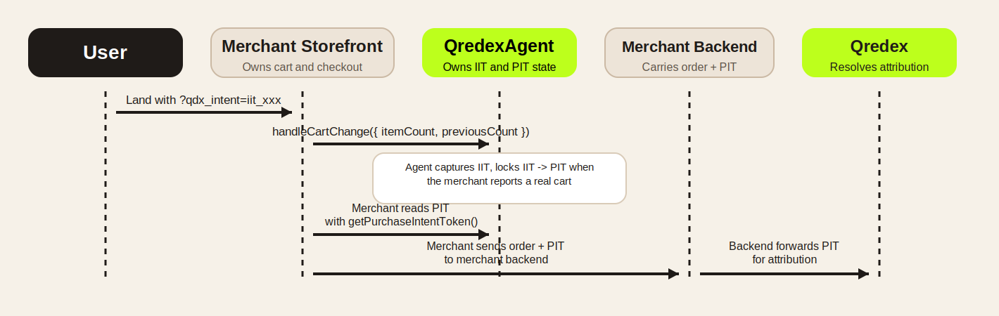

<!--
    ▄▄▄▄
  ▄█▀▀███▄▄              █▄
  ██    ██ ▄             ██
  ██    ██ ████▄▄█▀█▄ ▄████ ▄█▀█▄▀██ ██▀
  ██  ▄ ██ ██   ██▄█▀ ██ ██ ██▄█▀  ███
   ▀█████▄▄█▀  ▄▀█▄▄▄▄█▀███▄▀█▄▄▄▄██ ██▄
        ▀█

  Copyright (C) 2026 — 2026, Qredex, LTD. All Rights Reserved.

  DO NOT ALTER OR REMOVE COPYRIGHT NOTICES OR THIS FILE HEADER.

  Licensed under the Apache License, Version 2.0. See LICENSE for the full license text.
  You may not use this file except in compliance with that License.
  Unless required by applicable law or agreed to in writing, software distributed under the
  License is distributed on an "AS IS" BASIS, WITHOUT WARRANTIES OR CONDITIONS OF ANY KIND,
  either express or implied. See the License for the specific language governing permissions
  and limitations under the License.

  If you need additional information or have any questions, please email: copyright@qredex.com
-->

# Qredex Agent Flow

## Purpose

Qredex Agent is a lightweight browser runtime that captures the `qdx_intent` token issued by Qredex redirect traffic, stores it safely in the shopper session, and locks that IIT into a PIT through the public AGENT endpoint when the merchant reports a non-empty cart. The goal is to keep commerce ownership with the merchant while making IIT → PIT handling deterministic, consistent, and easy to embed on any storefront.

## Core Terms

-   **IIT** = Influence Intent Token. Click-time token issued when a shopper lands through a Qredex tracking link.
-   **PIT** = Purchase Intent Token. Lock-time token created when the shopper adds to cart.
-   **AGENT endpoint** = Public client-runtime endpoint used for PIT locking on cart events (`/api/v1/agent/intents/lock`).

---

## High-Level Flow

1.  Shopper clicks a Qredex tracking link.
2.  Qredex redirects to the merchant destination and appends `?qdx_intent=<IIT>`.
3.  Qredex Agent reads `qdx_intent` from the URL.
4.  Agent removes `qdx_intent` from the visible URL after inspection, even if PIT already exists and the IIT is ignored.
5.  If no PIT exists, agent stores the IIT in browser session storage and cookie fallback.
6.  Shopper browses the storefront.
7.  Merchant calls `handleCartChange()` when cart state changes.
8.  Agent checks whether:
    -   Reported cart is non-empty
    -   IIT exists
    -   PIT is not already present
    -   No lock request is already in flight
9.  Agent calls `POST /api/v1/agent/intents/lock`.
10. Qredex validates the IIT and returns a PIT on success.
11. Agent stores the PIT in browser storage.
12. Agent clears the IIT (PIT is now authoritative).
13. Merchant reads PIT from the agent during checkout/order assembly.
14. Merchant backend or direct Qredex ingestion path receives order payload + PIT.
15. Qredex resolves attribution from the PIT at order ingestion time.

### Minimum Correct Merchant Sequence

1. Load the agent bundle. CDN/script-tag integrations auto-init unless preload config sets `autoInit: false`.
   The default and recommended path is auto-init. IIT capture remains agent-owned.
2. Merchant reports the first real non-empty cart transition with `handleCartChange({ itemCount, previousCount })`.
3. Agent locks IIT → PIT when the reported cart is lockable.
4. Merchant reads PIT with `getPurchaseIntentToken()` during checkout or order assembly.
5. Merchant sends `order + PIT` to the backend or direct ingestion path.
6. Merchant clears attribution with `handleCartEmpty()` or `handlePaymentSuccess()` when commerce state is done.

---

## State Machine

The agent maintains a simple cart state machine:

```
┌─────────────┐
│   unknown   │ (initial state)
└──────┬──────┘
       │
       ▼
┌─────────────┐
│    empty    │◄────────────────┐
└──────┬──────┘                 │
       │                        │
       │ empty cart becomes non-empty │ non-empty cart becomes empty
       ▼                        │
┌─────────────┐                 │
│  non-empty  │─────────────────┘
└─────────────┘
```

**State transitions trigger actions:**

| Transition | Condition | Action |
|------------|-----------|--------|
| `unknown` → `empty` | Initial load | None |
| `empty` → `non-empty` | Merchant reports a non-empty cart | **Lock IIT → PIT** (if IIT exists, PIT doesn't) |
| `non-empty` → `non-empty` | Merchant reports a live non-empty cart again | **Attempt or retry lock on that cart event** if IIT exists and PIT doesn't |
| `non-empty` → `empty` | Cart emptied | **Clear IIT + PIT** |

---

## Canonical Runtime Sequence



---

## Token Lifecycle

### IIT (Influence Intent Token)

| Event | Action |
|-------|--------|
| URL has `?qdx_intent` | Capture and store in sessionStorage + cookie |
| PIT already exists | **Ignore new IIT** (locked attribution wins) |
| Lock succeeds | **Clear IIT** (PIT now authoritative) |
| Lock fails | Keep IIT (allow retry on the next merchant-reported non-empty cart event) |
| Cart becomes empty | **Clear IIT** |

### PIT (Purchase Intent Token)

| Event | Action |
|-------|--------|
| Lock succeeds | Store in sessionStorage + cookie |
| Lock fails | Do not create PIT |
| Cart becomes empty | **Clear PIT** |
| Checkout succeeds | **Clear PIT** |

---

## Merchant Integration

The merchant owns cart mutations, totals, checkout, and order submission. The
agent owns attribution state: IIT capture, IIT → PIT lock, and PIT exposure for
the order path.

### Primary Method: `handleCartChange()`

```typescript
// Merchant tells agent about cart state change
QredexAgent.handleCartChange({
  itemCount: 3,        // Current cart item count
  previousCount: 0,    // Previous cart item count
});
```

```typescript
// Merchant reads PIT when assembling the final order payload
const pit = QredexAgent.getPurchaseIntentToken();

await fetch('/api/orders', {
  method: 'POST',
  body: JSON.stringify({
    orderId: 'order-123',
    qredex_pit: pit,
  }),
});
```

**Transition rules:**

| `previousCount` | `itemCount` | Action |
|-----------------|-------------|--------|
| 0 | >0 | **Lock IIT → PIT** (if IIT exists) |
| >0 | >0 | **Attempt or retry lock on that cart event** if IIT exists and PIT doesn't |
| >0 | 0 | **Clear IIT + PIT** |
| 0 | 0 | None (state unchanged) |

### Convenience Wrappers

```typescript
// Empty cart (automatically clears tokens)
QredexAgent.handleCartEmpty();
```

### Manual Lock (Optional)

```typescript
// Usually not needed - handleCartChange() auto-locks
const result = await QredexAgent.lockIntent();

if (result.success) {
  console.log('PIT:', result.purchaseToken);
} else {
  console.error('Lock failed:', result.error);
}
```

### After Checkout

```typescript
// Most platforms will clear the cart after checkout
QredexAgent.handleCartEmpty();

// Optional explicit cleanup if checkout completes without a cart-empty step
QredexAgent.handlePaymentSuccess();
```

---

## Idempotency Rules

### Lock Operation

The lock operation is **idempotent** - safe to call multiple times:

1. **PIT already exists locally** → Return cached PIT immediately
2. **Lock already in flight** → Return same promise
3. **Backend returns `already_locked`** → Store PIT, return success

### Retry Behavior

| Scenario | Behavior |
|----------|----------|
| Lock fails (network error) | Keep IIT, **retry on the next merchant-reported non-empty cart event** |
| Lock fails (invalid IIT) | Keep IIT, **retry on the next merchant-reported non-empty cart event** |
| Lock succeeds | PIT stored, IIT cleared, no more retries |
| Cart emptied, then items added again | Clear tokens, capture new IIT if URL has it |

There is no background timer or scheduled retry loop. Retry is driven by a later merchant cart report through `handleCartChange()`.

**Rule 13:** If another item is added and PIT still does not exist, try locking again.

---

## Storage Behavior

### Keys

| Token | sessionStorage | Cookie |
|-------|----------------|--------|
| IIT | `__qdx_iit` | `__qdx_iit` |
| PIT | `__qdx_pit` | `__qdx_pit` |

### Priority

1. **sessionStorage** (primary)
2. **Cookie** (fallback)

### Security

- Cookies use `SameSite: Strict`
- Cookies scoped to `path=/`
- No sensitive data in localStorage

---

## Error Handling

### No IIT Available

```typescript
// Lock will fail with error
{
  success: false,
  error: 'No intent token available'
}
```

### Network Error

```typescript
// Lock fails, IIT preserved for retry
{
  success: false,
  error: 'Network error'
}
```

### HTTP Error

```typescript
// Lock fails, IIT preserved for retry
{
  success: false,
  error: 'HTTP 400: Invalid token'
}
```

---

## Debug Mode

Enable debug logging:

```html
<script>
  window.QredexAgentConfig = { debug: true };
</script>
```

**Example output:**

```
[QredexAgent] Intent token captured from URL
[QredexAgent] Cart change event received { itemCount: 1, previousCount: 0 }
[QredexAgent] Cart state updated: non-empty
[QredexAgent] Lock conditions met
[QredexAgent] Sending lock request to: https://api.qredex.com/...
[QredexAgent] Intent locked successfully
[QredexAgent] Purchase token stored
[QredexAgent] Intent token removed
```

---

## Related Documentation

- **[Installation](./INSTALLATION.md)** - Setup and integration
- **[API Reference](./API.md)** - Public API methods
- **[Lock Flow](./LOCK_FLOW.md)** - Detailed lock sequence
- **[Detection](./DETECTION.md)** - Add-to-cart detection strategies

---

## Support

For questions: support@qredex.com
