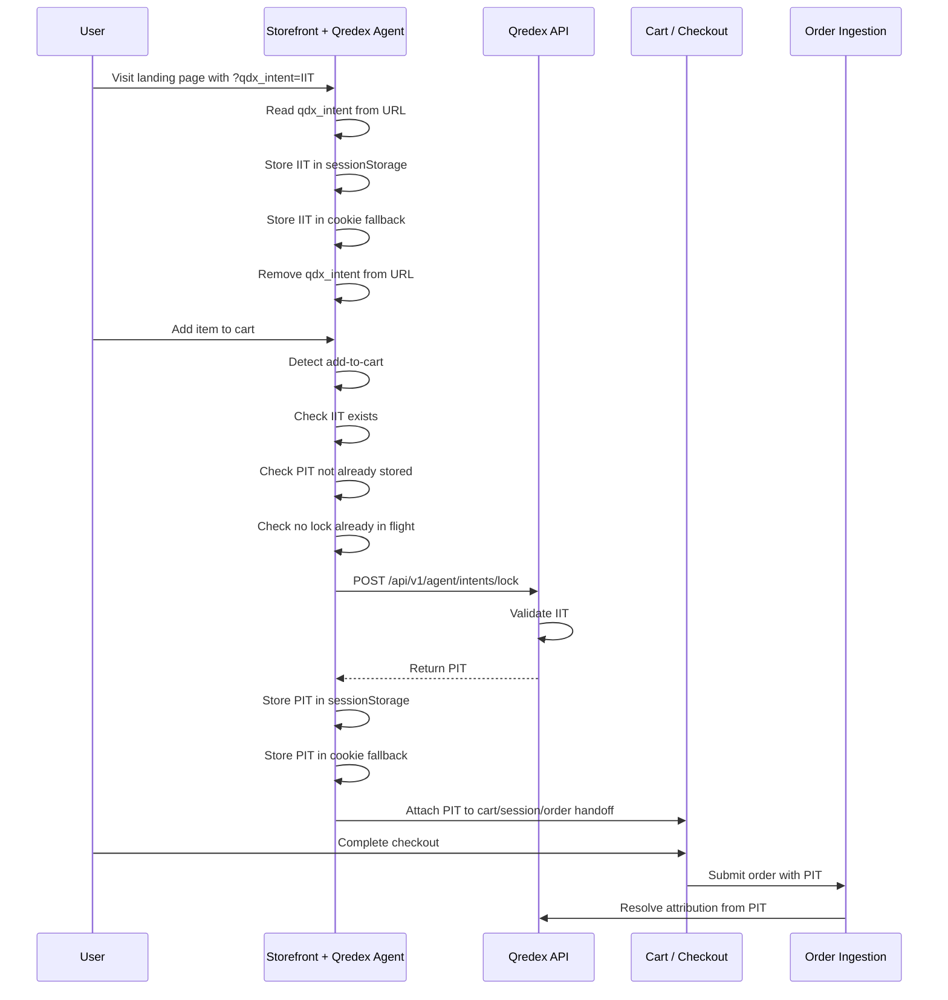

# Qredex Agent Flow

## Purpose

Qredex Agent is a lightweight browser runtime that captures the `qdx_intent` token issued by Qredex redirect traffic, stores it safely in the shopper session, detects add-to-cart activity, and locks that IIT into a PIT through the public AGENT endpoint. The goal is to make IIT → PIT handling simple, consistent, and easy to embed on any storefront.

## Core Terms

-   **IIT** = Influence Intent Token Click-time token issued when a shopper lands through a Qredex tracking link.
-   **PIT** = Purchase Intent Token Lock-time token created when the shopper adds to cart.
-   **AGENT endpoint** = Public client-runtime endpoint used for PIT locking on cart events.

---

## High-Level Flow

1.  Shopper clicks a Qredex tracking link.
2.  Qredex redirects to the merchant destination and appends `?qdx_intent=<IIT>`.
3.  Qredex Agent reads `qdx_intent` from the URL.
4.  Agent stores the IIT in browser session storage and cookie fallback.
5.  Agent removes `qdx_intent` from the visible URL.
6.  Shopper browses the storefront.
7.  Shopper adds an item to cart.
8.  Agent detects the add-to-cart event.
9.  Agent checks whether:
    -   IIT exists
    -   PIT is not already present
    -   no lock request is already in flight
10.  Agent calls `POST /api/v1/agent/intents/lock`.
11.  Qredex validates the IIT and returns a PIT on success.
12.  Agent stores the PIT in browser storage.
13.  Storefront/cart flow carries PIT forward into checkout/order handoff.
14.  Qredex later resolves attribution from the PIT at order ingestion time.

---

## Canonical Runtime Sequence

