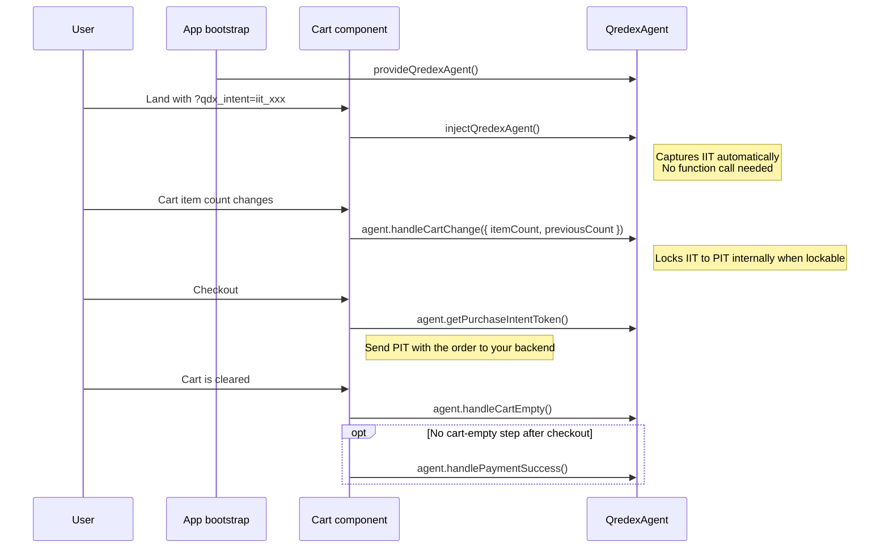

<!--
    ▄▄▄▄
  ▄█▀▀███▄▄              █▄
  ██    ██ ▄             ██
  ██    ██ ████▄▄█▀█▄ ▄████ ▄█▀█▄▀██ ██▀
  ██  ▄ ██ ██   ██▄█▀ ██ ██ ██▄█▀  ███
   ▀█████▄▄█▀  ▄▀█▄▄▄▄█▀███▄▀█▄▄▄▄██ ██▄
        ▀█

  Copyright (C) 2026 — 2026, Qredex, LTD. All Rights Reserved.

  DO NOT ALTER OR REMOVE COPYRIGHT NOTICES OR THIS FILE HEADER.

  This file is part of the Qredex Agent SDK and is licensed under the MIT License. See LICENSE.
  Redistribution and use are permitted under that license.

  If you need additional information or have any questions, please email: copyright@qredex.com
-->

# @qredex/angular

Thin Angular bindings for `@qredex/agent`.

## Install

```bash
npm install @qredex/angular
```

## Attribution Flow



Call `provideQredexAgent()` once at bootstrap, get the runtime with `injectQredexAgent()`, then forward merchant cart state with `agent.handleCartChange(...)`, read the PIT with `agent.getPurchaseIntentToken()`, and clear attribution with `agent.handleCartEmpty()`. Only call `agent.handlePaymentSuccess()` if your platform has no cart-empty step after checkout.

## Recommended Integration

Register `provideQredexAgent()` once, then call `injectQredexAgent()` inside the existing cart surface you already control.

```ts
import { bootstrapApplication } from '@angular/platform-browser';
import { Component, Input, OnChanges } from '@angular/core';
import { injectQredexAgent, provideQredexAgent } from '@qredex/angular';

bootstrapApplication(AppComponent, {
  providers: [
    provideQredexAgent(),
  ],
});

@Component({
  selector: 'qredex-cart-bridge',
  standalone: true,
  template: `
    <span>Qredex status: {{ agent.hasPurchaseIntentToken() ? 'locked' : 'waiting' }}</span>
    <button (click)="clearCart()">Clear cart</button>
    <button [disabled]="!agent.hasPurchaseIntentToken()" (click)="submitOrder()">
      Send PIT to backend
    </button>
  `,
})
export class QredexCartBridgeComponent implements OnChanges {
  @Input() itemCount = 0;

  private previousCount = 0;
  readonly agent = injectQredexAgent();

  ngOnChanges(): void {
    this.agent.handleCartChange({
      itemCount: this.itemCount,
      previousCount: this.previousCount,
    });

    this.previousCount = this.itemCount;
  }

  async clearCart(): Promise<void> {
    await fetch('/api/cart/clear', {
      method: 'POST',
    });

    this.agent.handleCartEmpty();
  }

  async submitOrder(): Promise<void> {
    const pit = this.agent.getPurchaseIntentToken();

    await fetch('/api/orders', {
      method: 'POST',
      headers: {
        'Content-Type': 'application/json',
      },
      body: JSON.stringify({
        orderId: 'order-123',
        qredex_pit: pit,
      }),
    });

    await this.clearCart();
  }
}
```

## What To Call When

| Merchant event | Call | Why |
|---|---|---|
| App bootstrap | `provideQredexAgent()` | Makes the agent available to Angular surfaces |
| Cart becomes non-empty | `agent.handleCartChange({ itemCount, previousCount })` | Gives Qredex the live cart state so IIT can lock to PIT |
| Cart changes while still non-empty | `agent.handleCartChange(...)` | Safe retry path on the next merchant-reported non-empty cart event if a previous lock failed |
| Clear cart action | `clearCart() -> agent.handleCartEmpty()` | Clears IIT/PIT from the live session |
| Need PIT for order submission | `agent.getPurchaseIntentToken()` | Attach PIT to the checkout payload |
| Checkout completes without a cart-empty step | `agent.handlePaymentSuccess()` | Optional explicit cleanup path |

## API Surface

| Export | Use |
|---|---|
| `provideQredexAgent()` | Primary Angular bootstrap helper |
| `provideQredex()` | Deprecated alias for `provideQredexAgent()` |
| `injectQredexAgent()` | Primary Angular injection helper |
| `getQredexAgent()` | Direct access to the singleton runtime |
| `initQredex()` | Explicit browser init when needed |
| `QREDEX_AGENT` | Angular injection token |
| `QredexAgent` | Re-export of the core agent |
