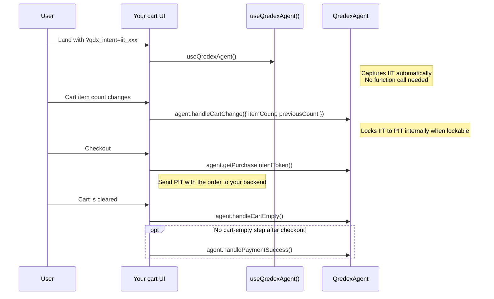

<!--
    ▄▄▄▄
  ▄█▀▀███▄▄              █▄
  ██    ██ ▄             ██
  ██    ██ ████▄▄█▀█▄ ▄████ ▄█▀█▄▀██ ██▀
  ██  ▄ ██ ██   ██▄█▀ ██ ██ ██▄█▀  ███
   ▀█████▄▄█▀  ▄▀█▄▄▄▄█▀███▄▀█▄▄▄▄██ ██▄
        ▀█

  Copyright (C) 2026 — 2026, Qredex, LTD. All Rights Reserved.

  DO NOT ALTER OR REMOVE COPYRIGHT NOTICES OR THIS FILE HEADER.

  This file is part of the Qredex Agent SDK and is licensed under the MIT License. See LICENSE.
  Redistribution and use are permitted under that license.

  If you need additional information or have any questions, please email: copyright@qredex.com
-->

# @qredex/svelte

Thin Svelte bindings for `@qredex/agent`.

## Install

```bash
npm install @qredex/svelte
```

## Attribution Flow



Call `useQredexAgent()`, then forward merchant cart state with `agent.handleCartChange(...)`, read the PIT with `agent.getPurchaseIntentToken()`, and clear attribution with `agent.handleCartEmpty()`. Only call `agent.handlePaymentSuccess()` if your platform has no cart-empty step after checkout.

## Recommended Integration

Use `useQredexAgent()` inside the existing cart surface you already own. The wrapper stays headless.

```svelte
<script lang="ts">
  import { useQredexAgent } from '@qredex/svelte';

  export let itemCount = 0;

  const { agent, state } = useQredexAgent();
  let previousCount = itemCount;

  $: if (itemCount !== previousCount) {
    agent.handleCartChange({
      itemCount,
      previousCount,
    });

    previousCount = itemCount;
  }

  async function clearCart() {
    await fetch('/api/cart/clear', {
      method: 'POST',
    });

    agent.handleCartEmpty();
  }

  async function submitOrder() {
    const pit = $state.pit ?? agent.getPurchaseIntentToken();

    await fetch('/api/orders', {
      method: 'POST',
      headers: {
        'Content-Type': 'application/json',
      },
      body: JSON.stringify({
        orderId: 'order-123',
        qredex_pit: pit,
      }),
    });

    await clearCart();
  }
</script>

<div>
  <span>Qredex status: {$state.locked ? 'locked' : 'waiting'}</span>
  <button on:click={clearCart}>Clear cart</button>
  <button disabled={!$state.hasPIT} on:click={submitOrder}>
    Send PIT to backend
  </button>
</div>
```

## What To Call When

| Merchant event | Call | Why |
|---|---|---|
| Cart becomes non-empty | `agent.handleCartChange({ itemCount, previousCount })` | Gives Qredex the live cart state so IIT can lock to PIT |
| Cart changes while still non-empty | `agent.handleCartChange(...)` | Safe retry path if a previous lock failed |
| Clear cart action | `clearCart() -> agent.handleCartEmpty()` | Clears IIT/PIT from the live session |
| Need PIT for order submission | `$state.pit` or `agent.getPurchaseIntentToken()` | Attach PIT to the checkout payload |
| Checkout completes without a cart-empty step | `agent.handlePaymentSuccess()` | Optional explicit cleanup path |

## API Surface

| Export | Use |
|---|---|
| `useQredexAgent()` | Primary Svelte composable. Returns `{ agent, state }` |
| `useQredex()` | Deprecated alias for `useQredexAgent()` |
| `createQredexStateStore()` | State store only, without the convenience composable |
| `getQredexAgent()` | Direct access to the singleton runtime |
| `initQredex()` | Explicit browser init when needed |
| `QredexAgent` | Re-export of the core agent |
