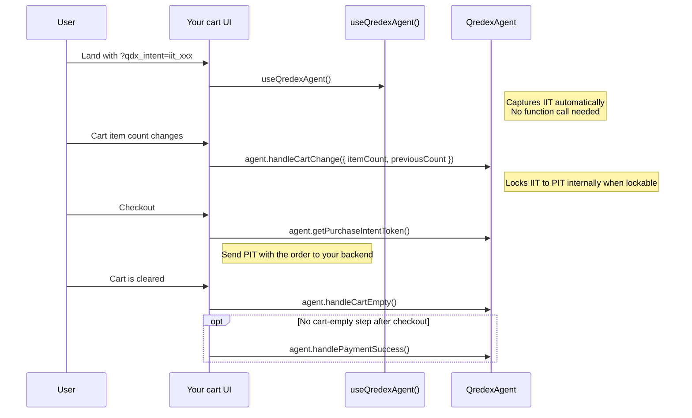

# @qredex/vue

Thin Vue bindings for `@qredex/agent`.

## Install

```bash
npm install @qredex/vue
```

## Attribution Flow



Call `useQredexAgent()`, then forward merchant cart state with `agent.handleCartChange(...)`, read the PIT with `agent.getPurchaseIntentToken()`, and clear attribution with `agent.handleCartEmpty()`. Only call `agent.handlePaymentSuccess()` if your platform has no cart-empty step after checkout.

## Recommended Integration

Register the plugin once, then use `useQredexAgent()` inside the cart surface you already control.

```ts
// main.ts
import { createApp } from 'vue';
import App from './App.vue';
import { createQredexPlugin } from '@qredex/vue';

const app = createApp(App);
app.use(createQredexPlugin());
app.mount('#app');
```

```vue
<script setup lang="ts">
import { ref, watch } from 'vue';
import { useQredexAgent } from '@qredex/vue';

const { agent, state } = useQredexAgent();
const itemCount = ref(0);
const previousCount = ref(0);

watch(itemCount, (nextCount) => {
  agent.handleCartChange({
    itemCount: nextCount,
    previousCount: previousCount.value,
  });

  previousCount.value = nextCount;
}, { immediate: true });

async function clearCart() {
  await fetch('/api/cart/clear', {
    method: 'POST',
  });

  agent.handleCartEmpty();
}

async function submitOrder() {
  const pit = state.value.pit ?? agent.getPurchaseIntentToken();

  await fetch('/api/orders', {
    method: 'POST',
    headers: {
      'Content-Type': 'application/json',
    },
    body: JSON.stringify({
      orderId: 'order-123',
      qredex_pit: pit,
    }),
  });

  await clearCart();
}
</script>

<template>
  <div>
    <span>Qredex status: {{ state.locked ? 'locked' : 'waiting' }}</span>
    <button @click="clearCart">Clear cart</button>
    <button :disabled="!state.hasPIT" @click="submitOrder">
      Send PIT to backend
    </button>
  </div>
</template>
```

## What To Call When

Merchant event

Call

Why

Cart becomes non-empty

`agent.handleCartChange({ itemCount, previousCount })`

Gives Qredex the live cart state so IIT can lock to PIT

Cart changes while still non-empty

`agent.handleCartChange(...)`

Safe retry path if a previous lock failed

Clear cart action

`clearCart() -> agent.handleCartEmpty()`

Clears IIT/PIT from the live session

Need PIT for order submission

`state.value.pit` or `agent.getPurchaseIntentToken()`

Attach PIT to the checkout payload

Checkout completes without a cart-empty step

`agent.handlePaymentSuccess()`

Optional explicit cleanup path

## API Surface

Export

Use

`createQredexPlugin()`

Registers the core agent in the Vue app

`useQredexAgent()`

Primary Vue composable. Returns `{ agent, state }`

`useQredex()`

Deprecated alias for `useQredexAgent()`

`useInjectedQredexAgent()`

Direct access to the injected agent

`getQredexAgent()`

Direct access to the singleton runtime

`initQredex()`

Explicit browser init when needed

`QredexAgent`

Re-export of the core agent
